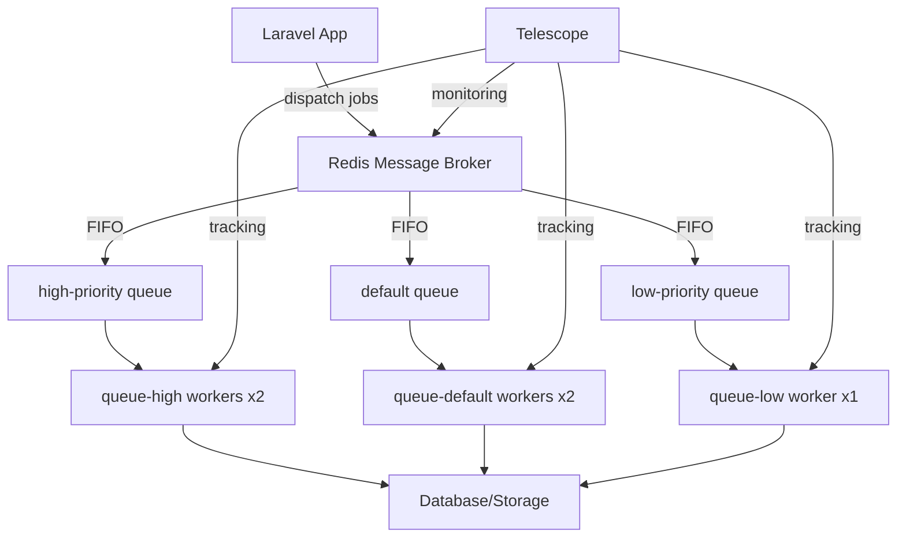

# Laravel Async Queues - Docker Queue Balance

> **Sistema de filas distribuídas com balanceamento automático usando Docker + Redis**

## 📋 Índice

- [Visão Geral](#-visão-geral)
- [Conceitos Fundamentais](#-conceitos-fundamentais)
- [Arquitetura do Sistema](#-arquitetura-do-sistema)
- [Load Balancing Automático](#-load-balancing-automático)
- [Workers e Priorização](#-workers-e-priorização)
- [Diferenças: Docker vs Kubernetes](#-diferenças-docker-vs-kubernetes)
- [Como Funciona na Prática](#-como-funciona-na-prática)
- [Comandos e Monitoramento](#-comandos-e-monitoramento)
- [Teoria: Message Brokers](#-teoria-message-brokers)

---

## 🎯 Visão Geral

Este projeto demonstra como implementar **filas distribuídas** usando Laravel + Docker + Redis, replicando o comportamento do **Laravel Horizon** sem sua complexidade. O sistema implementa **load balancing automático** entre múltiplos workers, garantindo alta disponibilidade e processamento eficiente.

### Objetivos Pedagógicos:
- ✅ Entender **load balancing** em sistemas distribuídos
- ✅ Implementar **workers concorrentes** com Docker
- ✅ Compreender **priorização de filas**
- ✅ Monitorar processamento com **Laravel Telescope**
- ✅ Simular ambiente **production-ready**

---

## 🧠 Conceitos Fundamentais

### 1. **Message Broker Pattern**
O Redis atua como **intermediário** entre produtores (app) e consumidores (workers):

```
APP (Producer) → REDIS (Message Broker) → WORKERS (Consumers)
```

### 2. **FIFO (First In, First Out)**
Jobs são processados na ordem de chegada em cada fila:
- Job mais antigo = primeira prioridade
- Garantia de ordem dentro da mesma fila
- Múltiplos workers competem pelos jobs

### 3. **Competing Consumers Pattern**
Múltiplos workers "competem" pelos mesmos jobs:
- **Atomicidade**: Apenas 1 worker pega cada job
- **Distribuição**: Redis distribui automaticamente
- **Eficiência**: Paralelização sem conflitos

### 4. **Priority Queues**
Sistema de prioridades baseado em importância:
- `high-priority`: Jobs críticos/urgentes
- `default`: Jobs normais do sistema
- `low-priority`: Jobs em background/cleanup

---

## 🏗️ Arquitetura do Sistema

### Componentes:



### Workers Hierarchy:

| Worker Type | Replicas | Queues Monitored | Sleep | Responsabilidade |
|-------------|----------|------------------|-------|------------------|
| `queue-high` | 2 | high → default → low | 1s | Jobs críticos + overflow |
| `queue-default` | 2 | default → low | 2s | Jobs normais + cleanup |
| `queue-low` | 1 | low | 3s | Background tasks |

---

## ⚖️ Load Balancing Automático

### Como Funciona:

#### 1. **Redis como Distribuidor**
```redis
# Jobs ficam em listas Redis
LPUSH queues:high-priority "job1"
LPUSH queues:high-priority "job2" 
LPUSH queues:high-priority "job3"

# Workers fazem BRPOP (blocking pop)
BRPOP queues:high-priority 5  # Worker 1 pega job1
BRPOP queues:high-priority 5  # Worker 2 pega job2
```

#### 2. **Competição Automática**
- **Atomicidade**: Redis garante que apenas 1 worker pega cada job
- **Distribuição**: Naturalmente balanceada entre workers disponíveis
- **Performance**: Sem overhead de coordenação central

#### 3. **Exemplo Prático**
Despachando 100 jobs para `high-priority`:

```
Worker queue-high-1: Jobs 1, 3, 5, 7, 9...  (50 jobs)
Worker queue-high-2: Jobs 2, 4, 6, 8, 10... (50 jobs)
```

**Resultado**: Distribuição automática ~50/50 sem configuração!

### Vantagens:

✅ **Zero configuração** - Redis faz tudo automaticamente  
✅ **Fault tolerance** - Worker falha? Outros continuam  
✅ **Linear scaling** - Mais workers = Mais throughput  
✅ **No single point** - Sem coordenador central  
✅ **Resource efficient** - Workers ociosos dormem  

---

## 👥 Workers e Priorização

### Sistema de Priorização Inteligente:

#### **Queue-High Workers (2 replicas)**
```yaml
command: php artisan queue:work redis --queue=high-priority,default,low-priority --sleep=1
```

**Comportamento:**
1. 🔥 Procura jobs em `high-priority` (urgente)
2. ⚡ Se vazia, procura em `default` (normal)
3. 🐌 Se vazia, procura em `low-priority` (background)
4. 😴 Se tudo vazio, dorme 1 segundo

#### **Queue-Default Workers (2 replicas)**
```yaml
command: php artisan queue:work redis --queue=default,low-priority --sleep=2
```

**Comportamento:**
1. ⚡ Procura jobs em `default`
2. 🐌 Se vazia, procura em `low-priority`
3. 😴 Se tudo vazio, dorme 2 segundos

#### **Queue-Low Worker (1 replica)**
```yaml
command: php artisan queue:work redis --queue=low-priority --sleep=3
```

**Comportamento:**
1. 🐌 Só processa `low-priority`
2. 😴 Se vazia, dorme 3 segundos

### Cenários de Carga:

| Situação | High Workers | Default Workers | Low Worker |
|----------|--------------|-----------------|------------|
| **Pico de tráfego** | Processam high + overflow para default/low | Ajudam com default + low | Limpa low-priority |
| **Carga normal** | Processam high + ajudam default | Processam default + low | Processa low |
| **Baixa carga** | Ociosos (dormindo) | Processam default | Processa low |

---

## 🔄 Diferenças: Docker vs Kubernetes

### **Docker Compose (Este Projeto)**

#### Características:
- 🔒 **Replicas Estáticas** - Número fixo definido no YAML
- 📊 **Previsível** - Sempre o mesmo número de containers
- 🛠️ **Scaling Manual** - Via comando ou edição do arquivo
- 💰 **Recursos Constantes** - Sempre consumindo a mesma quantidade

#### Configuração:
```yaml
deploy:
  replicas: 2  # SEMPRE 2 containers rodando
```

#### Scaling:
```bash
# Manual - editando arquivo
vim docker-compose.yml  # replicas: 5

# Manual - via comando
docker-compose up --scale queue-high=5 -d
```

### **Kubernetes (Comparação)**

#### Características:
- 🔄 **Auto-scaling** - Baseado em métricas (CPU, memória, custom)
- 📈 **Dinâmico** - Aumenta/diminui conforme demanda
- 🤖 **Automático** - HPA/VPA fazem o trabalho
- 💡 **Resource-aware** - Considera recursos disponíveis

#### Configuração:
```yaml
apiVersion: autoscaling/v2
kind: HorizontalPodAutoscaler
spec:
  minReplicas: 1
  maxReplicas: 10
  targetCPUUtilizationPercentage: 70
  # Escala de 1-10 baseado em CPU
```

#### Scaling:
```yaml
# Automático baseado em métricas
metrics:
- type: Resource
  resource:
    name: cpu
    target:
      type: Utilization
      averageUtilization: 70
```

### **Quando Usar Cada Um:**

| Aspecto | Docker Compose | Kubernetes |
|---------|----------------|------------|
| **Aprendizado** | ✅ Ideal | ❌ Complexo |
| **Desenvolvimento** | ✅ Simples | ❌ Overhead |
| **Produção pequena** | ✅ Suficiente | ❌ Over-engineering |
| **Produção enterprise** | ❌ Limitado | ✅ Ideal |
| **Auto-scaling** | ❌ Manual | ✅ Automático |
| **Monitoring** | ⚠️ Básico | ✅ Avançado |

---

## ⚙️ Como Funciona na Prática

### 1. **Despacho de Jobs**

```php
// Job automaticamente escolhe a fila baseada no batch size
ProcessCsvDataJob::dispatch($data, $batchSize);

// Ou definir fila explicitamente
ProcessCsvDataJob::dispatch($data)->onQueue('high-priority');
```

### 2. **Processamento Distribuído**

```
1. App despacha 100 jobs para high-priority
2. Redis armazena jobs na lista queues:high-priority
3. Workers queue-high fazem BRPOP para pegar jobs
4. Redis distribui automaticamente entre os 2 workers
5. Cada worker processa ~50 jobs
6. Telescope registra todo o processo
```

### 3. **Tolerância a Falhas**

```
Se queue-high-1 falhar:
- queue-high-2 continua processando
- Jobs não processados ficam na fila
- Docker restart: unless-stopped recria o container
- Processamento continua sem perda de jobs
```

### 4. **Priorização Dinâmica**

```
Cenário: 50 jobs high + 100 jobs default + 200 jobs low

Resultado:
- queue-high workers: Focam em high, depois ajudam default
- queue-default workers: Processam default, depois low  
- queue-low worker: Limpa low-priority restante
```

---

## 📊 Comandos e Monitoramento

### **Inicialização**
```bash
# Subir todo o ambiente
docker-compose up -d

# Verificar status dos workers
docker-compose ps

# Ver logs em tempo real
docker-compose logs -f queue-high
```

### **Processamento de Dados**
```bash
# Processar CSV com batch pequeno (low-priority)
docker-compose exec app php artisan process:csv-data --batch-size=10

# Processar com batch médio (default)
docker-compose exec app php artisan process:csv-data --batch-size=30

# Processar com batch grande (high-priority)  
docker-compose exec app php artisan process:csv-data --batch-size=60
```

### **Monitoramento Redis**
```bash
# Conectar no Redis
docker-compose exec redis redis-cli

# Ver jobs pendentes
LLEN queues:high-priority
LLEN queues:default
LLEN queues:low-priority

# Ver jobs em processamento
KEYS queues:*:reserved

# Monitorar em tempo real
MONITOR
```

### **Telescope Dashboard**
- **URL**: http://localhost:8080/telescope
- **Seção Jobs**: Visualizar todos os jobs das 3 filas
- **Filtros**: Por status (pending, processing, completed, failed)
- **Detalhes**: Tempo de execução, payload, queue utilizada

### **Scaling Manual**
```bash
# Aumentar workers de alta prioridade
docker-compose up --scale queue-high=4 -d

# Diminuir workers de baixa prioridade
docker-compose up --scale queue-low=0 -d

# Verificar nova configuração
docker ps | grep queue
```

---

## 🔬 Teoria: Message Brokers

### **O que é um Message Broker?**

Um **Message Broker** é um intermediário que facilita a comunicação entre diferentes partes de um sistema distribuído. No nosso caso, o **Redis** atua como broker entre a aplicação Laravel (producer) e os workers (consumers).

### **Padrões Implementados:**

#### 1. **Producer-Consumer Pattern**
```
Producer (Laravel App) → Broker (Redis) → Consumer (Workers)
```

**Benefícios:**
- **Desacoplamento**: App não precisa conhecer workers
- **Escalabilidade**: Adicionar workers não afeta o app
- **Reliability**: Jobs persistem mesmo se workers estiverem down

#### 2. **Competing Consumers Pattern**
```
Producer → Queue → [Consumer1, Consumer2, Consumer3...]
```

**Características:**
- Múltiplos consumers processam da mesma fila
- Cada mensagem é processada por apenas UM consumer
- Load balancing automático entre consumers

#### 3. **Priority Queue Pattern**
```
Producer → [High Queue, Default Queue, Low Queue] → Consumers
```

**Implementação:**
- Workers verificam filas por ordem de prioridade
- Jobs críticos são processados primeiro
- Background tasks não bloqueiam jobs importantes

### **Vantagens do Redis como Broker:**

✅ **Performance**: Operações in-memory extremamente rápidas  
✅ **Atomicidade**: BRPOP garante que apenas 1 worker pega cada job  
✅ **Persistence**: AOF/RDB garantem durabilidade dos jobs  
✅ **Simplicidade**: Estrutura de dados simples (listas)  
✅ **Monitoring**: Comandos nativos para observabilidade  

### **Comparação com Outros Brokers:**

| Feature | Redis | RabbitMQ | Apache Kafka |
|---------|-------|----------|--------------|
| **Performance** | ⭐⭐⭐⭐⭐ | ⭐⭐⭐⭐ | ⭐⭐⭐⭐⭐ |
| **Simplicidade** | ⭐⭐⭐⭐⭐ | ⭐⭐⭐ | ⭐⭐ |
| **Durabilidade** | ⭐⭐⭐⭐ | ⭐⭐⭐⭐⭐ | ⭐⭐⭐⭐⭐ |
| **Scaling** | ⭐⭐⭐ | ⭐⭐⭐⭐ | ⭐⭐⭐⭐⭐ |
| **Laravel Integration** | ⭐⭐⭐⭐⭐ | ⭐⭐⭐⭐ | ⭐⭐⭐ |

---

## 🎓 Conclusão

Este projeto demonstra conceitos fundamentais de **sistemas distribuídos** aplicados ao processamento de filas:

### **Conceitos Aprendidos:**
- ✅ **Load Balancing** automático com Redis
- ✅ **Competing Consumers** para alta performance
- ✅ **Priority Queues** para gestão de recursos
- ✅ **Fault Tolerance** com múltiplos workers
- ✅ **Monitoring** em tempo real com Telescope
- ✅ **Container Orchestration** com Docker Compose

### **Aplicações no Mundo Real:**
- 🏢 **E-commerce**: Processamento de pedidos por prioridade
- 📧 **Email Marketing**: Envio distribuído de campanhas  
- 🖼️ **Media Processing**: Redimensionamento de imagens
- 📊 **Data Pipeline**: ETL de grandes volumes de dados
- 🔔 **Notifications**: Push notifications escaláveis

### **Próximos Passos:**
1. 🚀 **Kubernetes**: Migrar para auto-scaling real
2. 📈 **Monitoring**: Prometheus + Grafana
3. 🔄 **Circuit Breaker**: Resilência avançada
4. 🌐 **Multi-Region**: Distribuição geográfica
5. 🔐 **Security**: Autenticação e autorização

---

## 📚 Recursos Adicionais

- [Laravel Queues Documentation](https://laravel.com/docs/queues)
- [Redis Commands Reference](https://redis.io/commands)
- [Docker Compose Reference](https://docs.docker.com/compose/)
- [Laravel Telescope](https://laravel.com/docs/telescope)
- [Message Patterns](https://www.enterpriseintegrationpatterns.com/patterns/messaging/)

---

**🔗 Autor**: Luiz Escobal  
**📅 Data**: Junho 2025  
**🎯 Objetivo**: Aprendizado de Sistemas Distribuídos com Laravel

