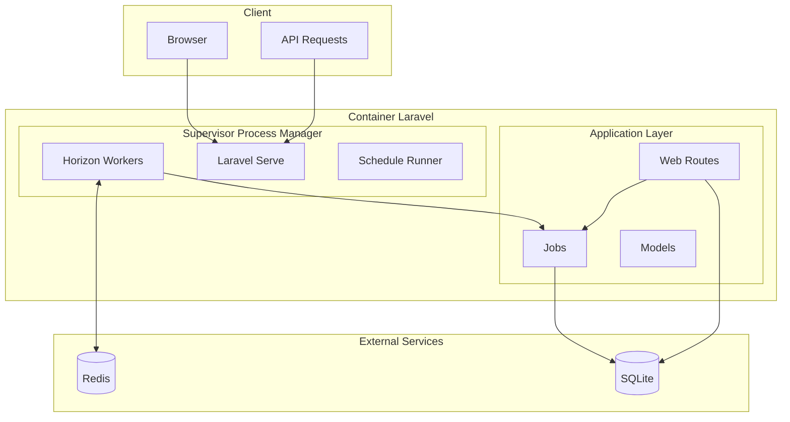

# Laravel Supervisor + Horizon: Guia Completo

> **Projeto educacional**: Implementação de filas assíncronas usando Supervisor e Horizon em container único para estudos de arquitetura de queues.

## 📋 Índice

1. [Conceitos Fundamentais](#conceitos-fundamentais)
2. [Arquitetura do Sistema](#arquitetura-do-sistema)
3. [Componentes Técnicos](#componentes-técnicos)
4. [Como Usar](#como-usar)
5. [Teoria das Filas](#teoria-das-filas)
6. [Patterns Implementados](#patterns-implementados)
7. [Monitoramento e Debugging](#monitoramento-e-debugging)
8. [Trade-offs Arquiteturais](#trade-offs-arquiteturais)
9. [Comparações com Outras Estratégias](#comparações-com-outras-estratégias)

---

## 🎯 Conceitos Fundamentais

### O que são Filas Assíncronas?

**Filas assíncronas** são estruturas de dados que permitem o processamento não-bloqueante de tarefas. Em vez de executar uma operação pesada durante uma requisição HTTP (blocking), a tarefa é "enfileirada" para ser processada posteriormente por **workers** dedicados.

#### Benefícios das Filas:
- **Performance**: Respostas HTTP mais rápidas
- **Escalabilidade**: Processamento distribuído
- **Resiliência**: Retry automático em caso de falhas
- **Isolamento**: Falhas em jobs não afetam a aplicação web

### Por que Redis como Message Broker?

O **Redis** é usado como **message broker** (intermediário de mensagens) por suas características:

```
┌─────────────┐    enqueue    ┌─────────┐    dequeue    ┌──────────┐
│   Laravel   │──────────────▶│  Redis  │──────────────▶│  Worker  │
│ Application │               │  Queue  │               │ Process  │
└─────────────┘               └─────────┘               └──────────┘
```

- **Velocidade**: Estrutura de dados em memória
- **Persistência**: Opcional (AOF/RDB) para durabilidade
- **Estruturas nativas**: Lists, Sets, Sorted Sets ideais para filas
- **Pub/Sub**: Para notificações em tempo real

---

## 🏗️ Arquitetura do Sistema

### Visão Geral da Arquitetura



### Fluxo de Dados

1. **Dispatch**: Aplicação envia job para Redis
2. **Queue**: Redis armazena job em fila específica
3. **Worker**: Horizon worker pega job da fila
4. **Process**: Job é executado pelo worker
5. **Complete**: Resultado salvo no banco/log

---

## ⚙️ Componentes Técnicos

### 1. Supervisor

**Supervisor** é um sistema de monitoramento de processos para Unix. No contexto deste projeto:

#### Responsabilidades:
- **Process Management**: Inicia, monitora e reinicia processos
- **Auto-restart**: Reinicia processos que falham
- **Logging**: Captura stdout/stderr dos processos
- **Daemonização**: Roda processos em background

#### Configuração (`supervisord.conf`):
```ini
[program:laravel-horizon]
command=php /var/www/artisan horizon
autostart=true
autorestart=true
user=www-data
redirect_stderr=true
stdout_logfile=/var/www/storage/logs/horizon.log
```

### 2. Laravel Horizon

**Horizon** é o dashboard e queue manager oficial do Laravel para Redis.

#### Funcionalidades:
- **Auto-balancing**: Distribui workers automaticamente
- **Real-time monitoring**: Dashboard em tempo real
- **Job retry**: Reprocessamento automático de falhas
- **Metrics**: Estatísticas de throughput e latência

#### Estratégias de Balanceamento:
```php
'balance' => 'auto',           // Distribui automaticamente
'autoScalingStrategy' => 'time', // Baseado no tempo de processamento
```

### 3. Queue Workers

**Workers** são processos que ficam executando continuamente, "ouvindo" as filas e processando jobs.

#### Ciclo de Vida de um Worker:
```
1. Connect to Redis
2. Listen for jobs
3. Fetch job from queue
4. Deserialize job payload
5. Execute job handle() method
6. Mark as completed/failed
7. Repeat
```

---

## 🚀 Como Usar

### Setup Inicial

```bash
# 1. Subir containers
docker-compose up -d

# 2. Verificar se serviços estão rodando
docker-compose ps

# 3. Acessar container
docker-compose exec app bash
```

### Processamento de Jobs

```bash
# Processar CSV com batch pequeno (mais jobs)
docker-compose exec app php artisan process:csv-data --file=low-size-data.csv --batch-size=2

# Monitorar em tempo real
# Browser: http://localhost:8000/horizon
```

### Comandos de Debug

```bash
# Ver status do Horizon
docker-compose exec app php artisan horizon:status

# Ver filas no Redis
docker-compose exec app php artisan queue:monitor

# Limpar jobs falhados
docker-compose exec app php artisan horizon:clear

# Ver logs do Supervisor
docker-compose exec app tail -f /var/log/supervisor/supervisord.log
```

---

## 📊 Teoria das Filas

### Queue Patterns

#### 1. **FIFO (First In, First Out)**
```
Job A → Job B → Job C
```
Default behavior - primeiro job entra, primeiro sai.

#### 2. **Priority Queues**
```php
ProcessCsvDataJob::dispatch($data)->onQueue('high-priority');
ProcessCsvDataJob::dispatch($data)->onQueue('default');
ProcessCsvDataJob::dispatch($data)->onQueue('low-priority');
```

#### 3. **Delayed Jobs**
```php
ProcessCsvDataJob::dispatch($data)->delay(now()->addMinutes(5));
```

### Load Balancing Strategies

#### Auto-scaling baseado em tempo:
- Monitora tempo médio de processamento
- Aumenta workers se tempo > threshold
- Diminui workers se fila vazia

#### Auto-scaling baseado em tamanho:
- Monitora quantidade de jobs pendentes
- Escala workers proporcionalmente

---

## 🔧 Patterns Implementados

### 1. **Command Pattern**
Jobs implementam o Command Pattern:

```php
class ProcessCsvDataJob implements ShouldQueue
{
    use Queueable;
    
    public function handle(): void
    {
        // Command execution logic
    }
}
```

### 2. **Observer Pattern**
Horizon observa mudanças nas filas:

```php
// Horizon escuta eventos de job
JobProcessed::class → Update metrics
JobFailed::class → Retry logic
```

### 3. **Strategy Pattern**
Diferentes estratégias de processamento:

```php
// Strategy para balanceamento
'balance' => 'auto',      // AutoBalanceStrategy
'balance' => 'simple',    // SimpleBalanceStrategy
'balance' => 'false',     // NoBalanceStrategy
```

### 4. **Repository Pattern**
Abstração do acesso a dados:

```php
class RedisJobRepository
{
    public function getPending(): Collection
    public function getCompleted(): Collection
    public function getFailed(): Collection
}
```

---

## 📈 Monitoramento e Debugging

### Horizon Dashboard

#### Seções Principais:

1. **Dashboard**: Overview geral
   - Jobs/min processados
   - Tempo médio de processamento
   - Workers ativos

2. **Workload**: Distribuição de carga
   - Jobs por fila
   - Workers por supervisor

3. **Recent Jobs**: Jobs recentes
   - Status (completed/failed)
   - Tempo de execução
   - Payload do job

4. **Failed Jobs**: Jobs falhados
   - Stack trace do erro
   - Botão de retry
   - Análise de falhas

### Métricas Importantes

```php
// Throughput
'jobs_per_minute' => 150,

// Latência
'average_time' => '2.5s',

// Utilização
'memory_usage' => '45MB',
'cpu_usage' => '15%',

// Filas
'pending_jobs' => 23,
'processed_jobs' => 1500,
'failed_jobs' => 3,
```

### Debugging Common Issues

#### 1. **Jobs não processam**
```bash
# Verificar se Horizon está rodando
php artisan horizon:status

# Verificar conexão Redis
php artisan tinker --execute="Redis::ping()"
```

#### 2. **Performance baixa**
```bash
# Aumentar workers
'maxProcesses' => 10,

# Otimizar jobs
- Reduzir tempo de processamento
- Usar batch processing
- Implementar chunking
```

#### 3. **Memory leaks**
```bash
# Configurar limits
'memory' => 128,     // MB
'maxTime' => 3600,   // seconds
'maxJobs' => 1000,   // jobs before restart
```

---

## ⚖️ Trade-offs Arquiteturais

### Vantagens desta Abordagem

#### ✅ **Simplicidade**
- Um único container
- Setup rápido para desenvolvimento
- Menos complexidade de networking

#### ✅ **Observabilidade**
- Dashboard integrado
- Logs centralizados
- Métricas em tempo real

#### ✅ **Desenvolvimento**
- Hot-reload fácil
- Debug simplificado
- Prototipagem rápida

### Limitações

#### ❌ **Escalabilidade**
- **Vertical scaling only**: Só pode escalar aumentando recursos
- **Single point of failure**: Um container down = sistema parado
- **Resource contention**: Todos os processos competem por CPU/RAM

#### ❌ **Isolation**
- **Shared resources**: Um processo pode afetar outros
- **Dependency coupling**: Atualizar um componente afeta todos
- **Error propagation**: Falha pode cascatear

#### ❌ **Operations**
- **Deploy complexity**: Precisa parar todos os serviços
- **Monitoring granularity**: Difícil monitorar componentes isoladamente
- **Resource allocation**: Não pode alocar recursos específicos por serviço

---

## 🔄 Comparações com Outras Estratégias

### 1. Microservices com Containers Separados

```yaml
# Estratégia Microservices
services:
  web:          # Apenas HTTP requests
  worker:       # Apenas processing
  scheduler:    # Apenas cron jobs
  redis:        # Message broker
  database:     # Data persistence
```

**Prós**: Isolation, scaling granular, fault tolerance
**Contras**: Complexidade, networking, orchestration

### 2. Kubernetes Jobs

```yaml
# Estratégia Kubernetes
apiVersion: batch/v1
kind: Job
metadata:
  name: csv-processor
spec:
  template:
    spec:
      containers:
      - name: worker
        image: laravel-app
        command: ["php", "artisan", "queue:work"]
```

**Prós**: Auto-scaling, cloud-native, enterprise-ready
**Contras**: Learning curve, infrastructure complexity

### 3. Serverless Functions

```javascript
// Estratégia Serverless (AWS Lambda)
exports.handler = async (event) => {
    // Process queue message
    const job = JSON.parse(event.Records[0].body);
    await processJob(job);
};
```

**Prós**: Pay-per-use, infinite scaling, no infrastructure
**Contras**: Cold starts, execution limits, vendor lock-in

### Comparação de Características

| Aspecto | Supervisor+Horizon | Microservices | Kubernetes | Serverless |
|---------|-------------------|---------------|------------|------------|
| **Complexidade** | 🟢 Baixa | 🟡 Média | 🔴 Alta | 🟡 Média |
| **Escalabilidade** | 🔴 Limitada | 🟢 Alta | 🟢 Alta | 🟢 Infinita |
| **Custos Dev** | 🟢 Baixo | 🟡 Médio | 🔴 Alto | 🟡 Médio |
| **Custos Prod** | 🟡 Médio | 🟡 Médio | 🔴 Alto | 🟢 Variável |
| **Time to Market** | 🟢 Rápido | 🔴 Lento | 🔴 Lento | 🟡 Médio |
| **Observabilidade** | 🟢 Boa | 🟡 Média | 🟢 Boa | 🔴 Limitada |

---

## 🎓 Conceitos para Estudo Avançado

### 1. **Message Patterns**
- Point-to-point vs Publish-Subscribe
- Request-Reply pattern
- Message routing
- Dead letter queues

### 2. **Distributed Systems**
- CAP Theorem aplicado a filas
- Eventual consistency
- Partition tolerance
- Consensus algorithms

### 3. **Performance Engineering**
- Throughput vs Latency trade-offs
- Batching strategies
- Circuit breaker pattern
- Bulkhead pattern

### 4. **Operational Excellence**
- Circuit breakers
- Retry strategies (exponential backoff)
- Health checks
- Graceful degradation

---

## 📚 Recursos para Aprofundamento

### Documentação Oficial
- [Laravel Queues](https://laravel.com/docs/queues)
- [Laravel Horizon](https://laravel.com/docs/horizon)
- [Redis Documentation](https://redis.io/documentation)
- [Supervisor Documentation](http://supervisord.org/)

### Livros Recomendados
- "Designing Data-Intensive Applications" - Martin Kleppmann
- "Building Microservices" - Sam Newman
- "Site Reliability Engineering" - Google SRE Team

### Papers Acadêmicos
- "Harvest, Yield, and Scalable Tolerant Systems" - Fox & Brewer
- "MapReduce: Simplified Data Processing" - Dean & Ghemawat

---

**🎯 Objetivo Educacional**: Este projeto demonstra conceitos fundamentais de sistemas distribuídos, patterns de messaging e trade-offs arquiteturais em um ambiente controlado e observável.
